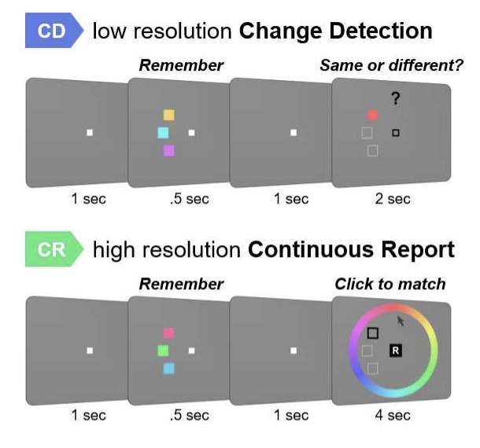
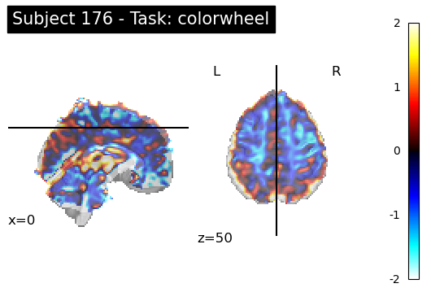
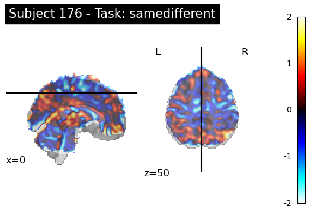
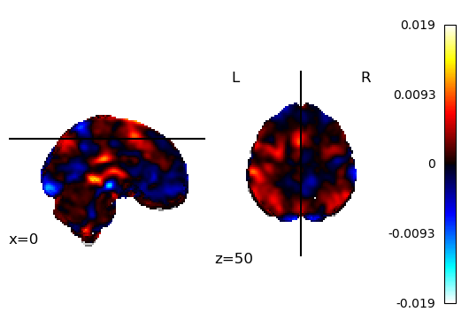
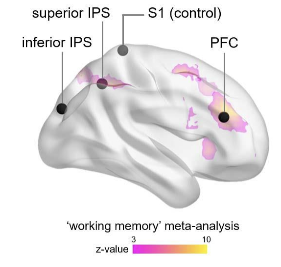

By Jennifer Hung, Judel Ancayan, Sahana Narayanan

# About

In our project, we looked into the performance of popular Multivoxel Pattern Analysis (MVPA) models in discriminating brain regions of interest for two different memory tasks using Functional MRI (fMRI) brain imaging data. fMRI data is a high dimensional and noisy data, and our project strives to show interpretability of such models and aid in increasing computing efficiency by locating regions of interest for future work on task fMRI. More specifically, we explored Support Vector Machine (SVM), Logistic Regression, Naive Bayes, and k-Nearest Neighbors (kNN). Our results show that different types of visual tasks are separable enough to pinpoint the different brain regions associated with each task. This website will briefly walk through our methods, resulting output, and a brief takeaway from this project.

# Background

Functional magnetic resonance imaging, or fMRI, is a means of visualizing the brain's activity. This activity is visualized by using magnets to resonate with highly oxygenated blood in the brain. We can use this blood as a fairly accurate proxy of brain activity since increases in brain activity require more oxygen in the brain, which is the reason this oxygen-rich blood is being delivered to the brain. Due to this phenomenon, we refer to the blood readings as the blood oxygenation level dependent, or BOLD.

Because these BOLD signals are collected over a period of time, they are then saved in a form of a four-dimensional array. This allows the data to be visualized as a video of the three-dimensional mapping of the brain, where each 3D pixel (also known as a voxel) in the brain corresponds to a BOLD signal stored in the array. By reading these BOLD signals, researchers are then able to research and analyze which parts of the brain tend to respond to various tasks and stimuli, providing a lot of insight into the neurological world!

In this project, we are using these BOLD signals to analyze which parts of the brain are responsible for various memory tasks. Specifically, we are testing the extent of distinction between two memory tasks in the brain. This testing is done by training various different models to read a collection of BOLD signals, and seeing if the models can predict which task was performed in order to produce those BOLD signals.

# Methods

## Data Collection

The dataset in our project was sourced from the paper by [Scimeca et al. (2018)](https://osf.io/58pyw). Subjects were asked to perform two different visual working memory tasks, and they would alternate between each task for 4 runs each for a total of one hour in a functional magnetic resonance imaging (fMRI) machine. The two tasks were fairly similar but for the memory recall part. Subjects were asked to memorize three differently colored patches, then after a delay they were cued to recall the color of one of the squares by using a color wheel (task ‘color wheel’) or performing a binary response (task ‘same different’).

We selected 34 subjects from the original pool of subjects, and each subject had performed 4 runs of both tasks. The brain imaging data is a 4-dimensional image containing brains as voxels and the time series data.

## First-level analysis

To begin with, we extracted the beta weights for every run of each task for every subject. Beta weights can allow us to gain information about the amount of correlation between the task and the voxels within each brain over the task period.

To achieve this, we performed a first-level analysis on individual participants by fitting a General Linear Model (GLM) for each run within two visual tasks. Our function took in information on the subject ID and task type to calculate the design matrix with the subject’s events file and brain imaging data. This resulted in the output of a number for every voxel within the brain. We then applied a mask over the brain image to get only the voxels within the brain. We then trained the models with every single voxel in the brain as a feature.

Notably, we created two versions of the fMRI brain imaging dataset:

- A denoised, cleaned brain image

  
 

- A confounded brain imaging (including the extra white matter, cerebral spinal fluid, brain rotation and translation noise for each individual)

  
 

## Model building

For each individual run in our dataset, we flattened the 3-dimensional beta weights into a 2-dimensional array as a data point with 235, 375 features. We then trained our dataset on [SVM](https://www.geeksforgeeks.org/support-vector-machine-algorithm/), [Naive Bayes](https://www.geeksforgeeks.org/naive-bayes-classifiers/), [Logistic Regression](https://www.geeksforgeeks.org/understanding-logistic-regression/), and [k-Nearest Neighbors](https://www.geeksforgeeks.org/k-nearest-neighbours/). Our evaluation metric included accuracy.

# Results

Our accuracies for each model for each dataset are as follows:

| Model               | Accuracy | Accuracy (with confounds) |
| ------------------- | -------- | ------------------------- |
| Baseline SVM        | 0.97     | 0.94                      |
| Logistic Regression | 0.97     | 0.94                      |
| Naive Bayes         | 0.58     | 0.63                      |
| kNN                 | 0.84     | 0.8                       |

To understand which brain regions were correlated with each task, we chose to plot the model coefficients back as a 3D brain. As the model coefficients for Logistic Regression are the most interpretable, we transformed the 1-dimensional array of coefficients into a 3-dimensional brain map.

 

From our model coefficients, we can interpret that predicting the ‘same different’ task is highly correlated with the beta weights from the prefrontal cortex (red region), while the ‘color wheel’ task is associated with the intraparietal sulcus (blue region).

# Conclusion

From our high model accuracies with little to no modification to the model, we can clearly distinguish between specific brain regions for each visual memory task with every mode. Moreover, due to the high interpretability of coefficients for Logistic regression, we can directly plot the brain map to see which regions were associated with which task. Within neuroscience, we see that MVPA can be a way of locating brain regions for future analysis without making prior assumptions. Furthermore, there may be fundamental differences in neural pathways between abstract versus visual detail working memory tasks. In terms of MVPA as a technique, we can use it to locate regions of interest and perform dimension reduction by reducing the amount of voxels in training data and improving computational efficiency. Our preliminary but promising results open up more research areas to study in terms of task fMRI classification.

# Special Thanks!

We want to thank [Dr. Armin Schwartzman](https://schwartzman.scholar.st) and [Gabriel Riegner](https://griegner.github.io) for their advice and support throughout this project, [Dr. Anastasia Kiyonaga](https://www.kiyonagalab.org/pi-anastasia-kiyonaga) and Sihan Yang for lending and explaining the dataset, and HDSI for printing the poster. We could not have done this without you!
